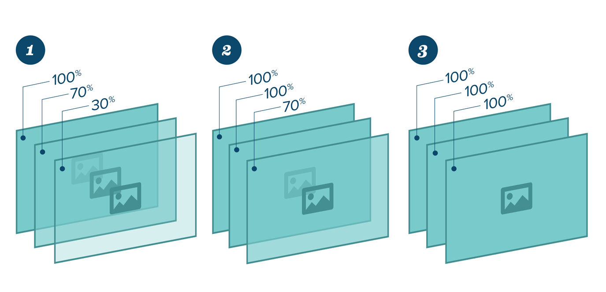
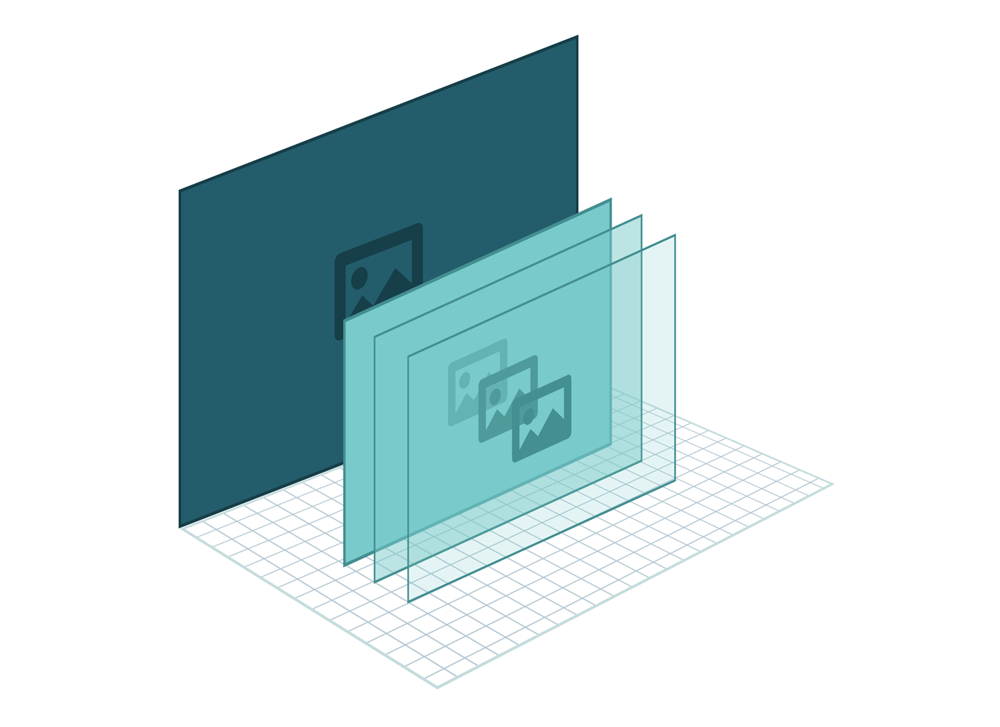
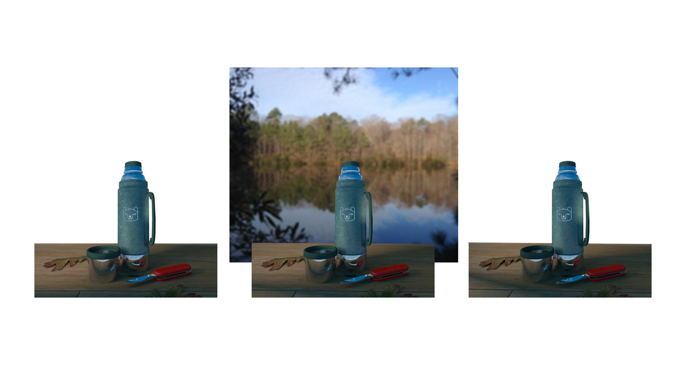

# No video, no problem: Creating interactive video effects with JavaScript

Matt Campbell shows how JavaScript and a few image layers can produce
impressive video-quality animations you can enhance with interactive elements
like motion controls and head-tracking.

## Details

Knowledge Needed: Basic HTML, CSS, JavaScript

Requires: Text editor and browser; reference images

Project Time: 45 minutes

Callout: Download the files! All the files you need for this tutorial can be
found at
[https://github.com/growcode/tutorial-js-lighting](https://github.com/growcode/tutorial-js-lighting)

ZIP download: https://github.com/growcode/tutorial-js-lighting/archive/master.zip

Modern web users have embraced video, but developers often find
video integration problematic due to cross-device/platform limitations (most
mobile browsers do not support auto-play for inline video) and fewer
opportunities to infuse playback with user interactivity. With some fairly
simple methods, you can replicate video-like effects without needing to
transcode large files or fight auto-play restrictions on mobile devices.

This guide will step through some simple techniques to create dynamic lighting
effects by progressively adjusting the opacity of three image layers. The
resulting effect will look like as smooth as video -- check out the demo here:
[https://growcode.github.io/tutorial-js-lighting/demos/](https://growcode.github.io/tutorial-js-lighting/demos/).
As a bonus we'll also show some ways to enhance these animations
with a few fun opportunities for user interactions.

## Image setup

First you'll need to create 3 images of the same object/scene with different
lighting configurations. The first image should show the initial state of the
effect, the second image will be the middle transition, and the third image
will be the final state.

## Stacking the images

1. Set up a `
` container element that has `position: relative` style.
2. Add each `` inside the container with `position: absolute`.

The `absolute` positioning will allow the images to stack on top of each other
while the container's `relative` style prevents the images from escaping to
the top of the page.

The HTML and CSS code should look something like:

    <!doctype html>
    <html>
      <head>
      
      <body>
        

          
          
          
        

        
      </body>
    </html>

## Tracking the images in code

We need a very basic structure in the code to track and fade the images.
This structure can also keep track of the animation's progress. It looks like:

    function Shader(images) {
      this.images = images;
    }

The constructor here just accepts a `NodeList` of images we will be tracking.
Using the handy querySelectorAll function
([https://developer.mozilla.org/en-US/docs/Web/API/Document.querySelectorAll](https://developer.mozilla.org/en-US/docs/Web/API/Document.querySelectorAll))
to get the images from the DOM, we can construct our object like so:

    var container = document.getElementById('container');
    var shader = new Shader(container.querySelectorAll('img'));

## Opacity changes

The lighting effect is achieved by showing the image on the bottom of the
stack first, unmodified. In fact the bottom image is never faded at all -
it is just what the user sees first.

As the animation progresses, we gradually fade in the images from
bottom-to-top, so the user will see the middle image fade in first,
followed by the top image a few moments later.

| 

|
| ------------- |
| <b>Flurry of Fades</b> <ol><li>We start out with our back-most image at full opacity and each of the other two images layered on top with lesser opacity.</li><li>As we progress, the second image layer comes into full opacity, obscuring the back-most layer.</li><li>In our final state, the third image has become fully opaque, representing the final state of our animation.</li></ol>|

We can do this by tracking the `progress` of the animation from 0 to 1
(0% to 100%, if you like). Based on that `progress` variable we can fade the
top images appropriately so that the middle image finishes its fade-in before
the final image:

    function clamp(value, min, max) {
      return Math.max(min, Math.min(max, value));
    }

    Shader.prototype.update = function (progress) {
      this.images[1].style.opacity = clamp(progress - 0.33, 0, 0.33) / 0.33;
      this.images[2].style.opacity = clamp(progress - 0.66, 0, 0.33) / 0.33;
    };

The `clamp` function here simply keeps `progress` within the bounds of `0`
and `0.33` (the max it will be divided by). This is necessary because before
the animation is at 66% progress, the final image would calculate
`progress - 0.66` as a negative number (e.g. `-0.66`) -- it's
better to just keep it at `0` in that case since that image is not supposed to
be fading yet. This will delay the fading of that image until the animation
progress is beyond 66% (the only time `progress - 0.66` would be positive).

In the `update` function, the first opacity line instructs the middle image to
fade in between 33% and 66% of the animation. The final image starts fading at
66% and finishes at 99% (basically the end).

## Tweening

Now that our animation is able to react to a `progress` variable, it's time
to animate that variable. Applying the current time to a sine wave is an easy
way to do this, providing a natural bounce from 0 to 1.

    /* Define the animation loop */
    function animate() {
        /* Get sine for current time */
        var angle = Math.sin(Date.now() * 0.002);

        /* Normalize sine to 0 through 1 */
        var progress = (1 + angle) * 0.5;

        /* Ask animation to update the fades */
        shader.update(progress);

        /* Repeat! */
        requestAnimationFrame(animate);
    }

    /* Begin animation */
    animate();

First we get the current time in milliseconds using `Date.now()`. Multiplying
it by `0.002` will slow down the "bounce" of the sine wave.

Our animation expects a range of `0 to 1`. Since sine waves are in the
`-1 to 1` range we have to normalize the range using `(1 + angle) * 0.5`.

Next, we pass the resulting `progress` variable to our animation to update
the fades of the images.

Finally we use requestAnimationFrame
([https://developer.mozilla.org/en-US/docs/Web/API/window.requestAnimationFrame](https://developer.mozilla.org/en-US/docs/Web/API/window.requestAnimationFrame))
to call a function the next time the browser paints the
window (usually synced to your monitor's refresh rate). If your browser
doesn't support this, you can just use `setTimeout` instead:

    setTimeout(animate, 16); // 16ms = ~60fps

## Animating other properties
Animating the opacity is already an interesting effect, but you can animate
any CSS property in the same way. One cool addition is to add a
background image that moves along with the `progress` variable. This would
create a "parallax" effect, adding even more depth to the scene. Check out
this example: [https://growcode.github.io/tutorial-js-lighting/demos/parallax.html](https://growcode.github.io/tutorial-js-lighting/demos/parallax.html)

| 

|
| ------------- |
| <b>Line 'em up</b> By placing our opacity-based animation layers in front of a single background plane, we can use a parallaxing effect to help "sell" our illusion of lighting. Tying the movement of this background image to the lighting animation makes the user feel like our scene's camera is swinging around our object rather than light is simply passing over it. |

First we need to update the CSS to put a background image in the container:

    #container {
        position: relative;
        width:800px;
        height:800px;
        overflow:hidden;
        background: url(images/background.png);
    }

Since the background image will be scrolling, it must be wider than the image
container. The CSS code forces the container to stay `800x800` in size and
the `overflow:hidden` hides the part of the background image that falls
outside that container.

In the code, we are already tracking the `container` DOM object. We will now be
animating the `backgroundPosition` style to move the background image.

In the previous `animate()` function, we can update this property right
after the `shader.update(progress)` call:

    function animate() {
        var angle = Math.sin(Date.now() * 0.002);
        var progress = (1 + angle) * 0.5;
        shader.update(progress);

        /* Move the background image */
        container.style.backgroundPosition = -50 + progress * 50 + 'px 0';

        requestAnimationFrame(animate);
    }

As the animation progresses, this will will move the background 50 pixels.

|

|
| ------------- |
| <b>Image Magic</b>  In order to see our parallaxing image in the background, we have to make parts of our foreground opacity assets contain transparent holes. As you can see here, the cutouts around the thermos images will expose the lake and trees behind it. If you wanted to get even more complex, you could add a second (or third) parallaxing element between the lake and thermos imageset for added detail. |

## Adding interactivity

Since the animation reacts to the value of the `progress` variable,
we can choose to adjust that variable based on any input instead of just
bouncing it with a sine formula. One cool and easy input you should try using
is the HeadTrackr library ([https://github.com/auduno/headtrackr/](https://github.com/auduno/headtrackr/)), which
seamlessly adds headtracking to a webpage.

|

|
| ------------- |
| <b>All About Perspective</b>  Once we know the position of the user's head in relation to their webcam, we can turn off auto-animation of our lighting effect and instead tie it to the user's position. When the user moves left, we can shift make it feel like our light source is shifting to the right, and vice versa as the user moves right.|

By tying the animation progress to the position of the user's face, we can
create the illusion that the user is "looking around" the object. We'll
capture the value of the user's face from the webcam and adjust the light
shading to mimic a real-world interaction. Check out a demonstration here: [https://growcode.github.io/tutorial-js-lighting/demos/headtracking.html](https://growcode.github.io/tutorial-js-lighting/demos/headtracking.html)

First, download the js file ([https://github.com/auduno/headtrackr/blob/master/headtrackr.min.js](https://github.com/auduno/headtrackr/blob/master/headtrackr.min.js))
 and reference it in your `<head>` tag:

    

This will expose a global `htracker` object that we'll use later.

The headtrackr library needs a `<video>` and `<canvas>` element to work its
magic. These are actually invisible and we can just add them beneath the
`container` div:

    <canvas id="inputCanvas" width="320" height="240" style="display:none"></canvas>
    <video id="inputVideo" autoplay loop style="display:none"></video>

Now we'll be able to listen for a `headtrackingEvent` event. The headtrackr
library fires this event any time it has an updated position for the user's
head. That event will tell us the `x` (horizontal) position of the user's head,
which we will then simplify to the `0..1` range and pass on to the animation.

This would replace the `animate()` function we were using before.

    /* Initialize headtrackr with the input video/canvas */
    var videoInput = document.getElementById('inputVideo');
    var canvasInput = document.getElementById('inputCanvas');
    var htracker = new headtrackr.Tracker();
    htracker.init(videoInput, canvasInput);

    /* Listen for when the user's head moves */
    document.addEventListener('headtrackingEvent', function (e) {
        /* Restrict value range to -10 .. 10 and divide to -1 .. 1 */
        var headX = Math.max(-10, Math.min(10, e.x)) * 0.1;

        /* Convert range from -1 .. 1 to 0 .. 1 */
        var progress = (1 + headX) * 0.5;

        /* Update the animation */
        shader.update(progress);
    });

    /* Tell headtrackr we're ready for the events */
    htracker.start();

Now after headtrackr finds your head, you should be able to move around to
change the light shading animation.

Laptop users can actually move the laptop instead of their head, making it
appear more like a gyroscope-powered effect.

# Conclusion
They say necessity is the mother of invention, but in this case we didn't
need a new shiny library or browser update to solve a problem, just a few pre-existing,
dependable techniques. The code involved is neither new nor complex, though hopefully
you'd agree that the end result is pretty neat. It's always fun to apply
what you already know to newer challenges and it's especially cool
to mix newer web technology (headtracking) with old.

# Boxout #1: Why Not Video?

Video offers functionality similar the features described in this article. Specifically,
videos are animations that are normalized to a 0% - 100% progress. Modern HTML5
browsers even expose an API to update a video's progress with JavaScript.

But the power of HTML5 video comes with its own caveats.

First and foremost is the ever-changing land of codecs. Mobile devices are
close to ubiquitously supporting H.264, but the desktop platforms still have
configurations that don't support it. Firefox in particular relies completely
on the OS to provide support for that codec. These situations call for
transcoding your video to formats like Theora or the newer WebM codec. This
is quite a difference from the dependability of JPEG and PNG image support.

HTML5 video on mobile also suffers from playback limitations. At Grow just a few months ago, we had a client
who wanted video-quality effects in an HTML5 ad that was targeted to tablets.
But on both Android and iOS, HTML5 video (and audio) cannot autoplay at all. In
fact they can't play unless the user initiates them with a touch action.

The technique described in this article was used to work around this limitation
to provide an effect that animates automatically and can also react to
non-touch interactions such as tilting (accelerometer input).

# Boxout #2: (References)

### querySelectorAll
querySelectorAll provides the ability to find elements in the DOM using
CSS selectors, similar to how jQuery works.

[https://developer.mozilla.org/en-US/docs/Web/API/Document.querySelectorAll](https://developer.mozilla.org/en-US/docs/Web/API/Document.querySelectorAll)

### requestAnimationFrame
You can hook into the browser's rendering loop by passing a callback function
to requestAnimationFrame. The browser will invoke the callback after each
screen paint.  Typically this is vsynced to the monitor and also intelligently
stops updating if the tab becomes inactive.

[https://developer.mozilla.org/en-US/docs/Web/API/window.requestAnimationFrame](https://developer.mozilla.org/en-US/docs/Web/API/window.requestAnimationFrame)

### headtrackr
This library makes it easy to integrate head tracking into your webpage. The
works on any WebRTC-compliant browsers by applying computer vision techniques
using a webcam as the video source.

[https://github.com/auduno/headtrackr/](https://github.com/auduno/headtrackr/)

### H.264 Codec Support
[http://caniuse.com/mpeg4](http://caniuse.com/mpeg4)

### WebM Codec Support
[http://caniuse.com/webm](http://caniuse.com/webm)

# About the author

    IMAGE #5 (author headshot)

Name: Matt Campbell

Job: Developer at Grow in Norfolk, VA

Web: https://github.com/codingcampbell/

Areas of expertise: HTML5, JavaScript, LAMP
